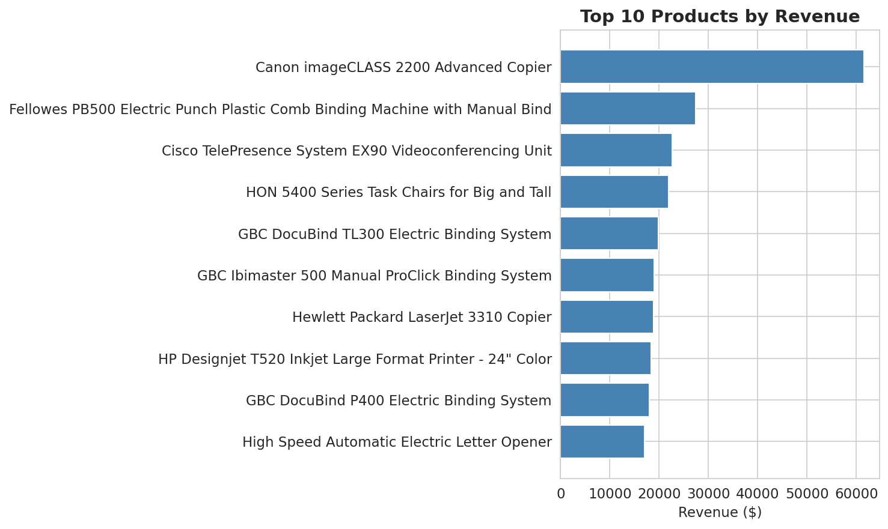
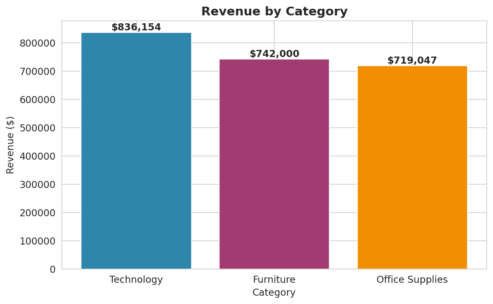
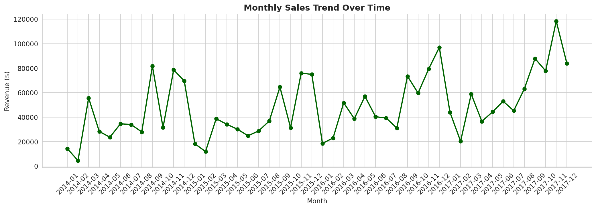
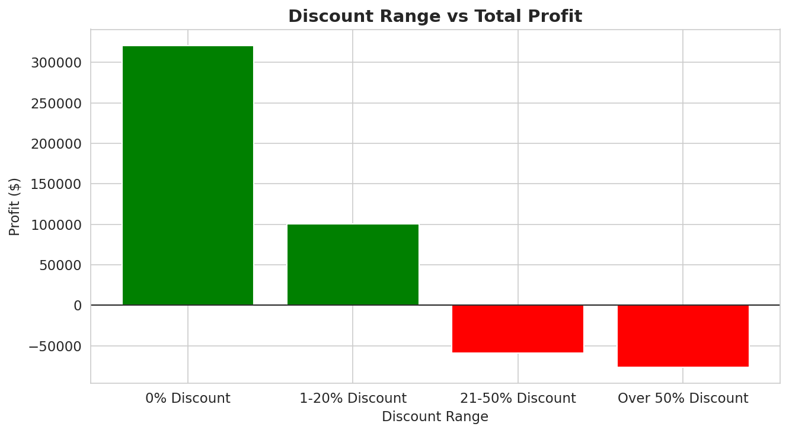

# 🛒 Automated Sales Analytics Pipeline

An end-to-end data pipeline that ingests messy sales data, cleans it, stores it in a SQLite database, runs SQL-based business analytics, generates visual reports, and automates report delivery to Google Sheets — all from a single Python notebook.

---

## 📌 Project Overview

This project simulates a real-world business reporting workflow. A small business owner typically spends hours every month manually creating sales reports in Excel. This pipeline reduces that work to **under 30 seconds**, while producing more reliable, repeatable, and insight-rich reports.

**Business value:** Saves time, reduces human error, and surfaces hidden insights such as products that generate revenue but lose money.

---

## 🔧 Tech Stack

| Layer | Tool |
|---|---|
| Language | Python 3 |
| Data Processing | Pandas, NumPy |
| Database | SQLite |
| Querying | SQL |
| Visualization | Matplotlib, Seaborn |
| Reporting | OpenPyXL (Excel), gspread (Google Sheets) |
| Environment | Google Colab |

---

## 🏗️ Pipeline Architecture

```
Sales CSV → Python → Data Cleaning → SQLite DB → SQL Analysis → Charts + Excel Report → Google Sheets
```

1. **Ingest** raw CSV sales data
2. **Clean** the data (handle missing values, fix data types, remove duplicates and invalid records)
3. **Store** clean data in a SQLite database
4. **Analyze** the data using SQL queries
5. **Visualize** insights with charts
6. **Generate** a multi-sheet Excel report
7. **Automate** report delivery to Google Sheets

---

## 📊 Key Business Insights Generated

- **Top 10 best-selling products** by revenue
- **Revenue and profit performance** across product categories
- **Monthly sales trends** to identify seasonality
- **Top 10 customers** by lifetime value
- **Best-performing regions** for strategic expansion
- **Loss-making products** that generate revenue but destroy profit
- **Discount impact analysis** — discovered that orders with >50% discount consistently produced losses

---

## 📈 Sample Visualizations

### Top 10 Products by Revenue


### Revenue by Category


### Monthly Sales Trend


### Discount Impact on Profit


---

## 🗂️ Repository Structure

```
automated-sales-analytics-pipeline/
│
├── README.md                          # Project documentation
├── notebook/
│   └── Sales_Reporting_System.ipynb   # Main pipeline notebook
├── data/
│   └── README.md                      # Dataset source and setup
├── database/
│   └── sales.db                       # SQLite database (output)
├── reports/
│   └── Business_Report.xlsx           # Multi-sheet Excel report
└── charts/
    ├── chart_top_products.png
    ├── chart_categories.png
    ├── chart_monthly_trend.png
    └── chart_discount_impact.png
```

---

## 🚀 How to Run

1. Clone this repository
2. Download the dataset from [Kaggle](https://www.kaggle.com/datasets/vivek468/superstore-dataset-final) and place it in the `data/` folder
3. Open `notebook/Sales_Reporting_System.ipynb` in Google Colab
4. Upload the CSV file when prompted
5. Run all cells in order
6. Sign in to your Google account when prompted (for Sheets export)

---

## 📚 What I Learned

- Building end-to-end data pipelines from raw data to delivered reports
- Writing production-style SQL queries with aggregations, grouping, and conditional logic
- Designing reusable analysis functions in Python
- Automating report delivery through Google Sheets API
- Translating raw data into actionable business insights

---

## 🎯 Skills Demonstrated

`Python` `Pandas` `NumPy` `SQL` `SQLite` `Data Cleaning` `Data Analytics` `Business Reporting` `Matplotlib` `Google Sheets Automation` `Workflow Automation` `Problem Solving`

---

## 👤 Author

**Aisha Islam**
Computer Science | BRAC University
📧 ayasha.islam@g.bracu.ac.bd
🔗 [LinkedIn](https://www.linkedin.com/in/ayashaislam)

---

⭐ If you found this project helpful, consider giving it a star!
